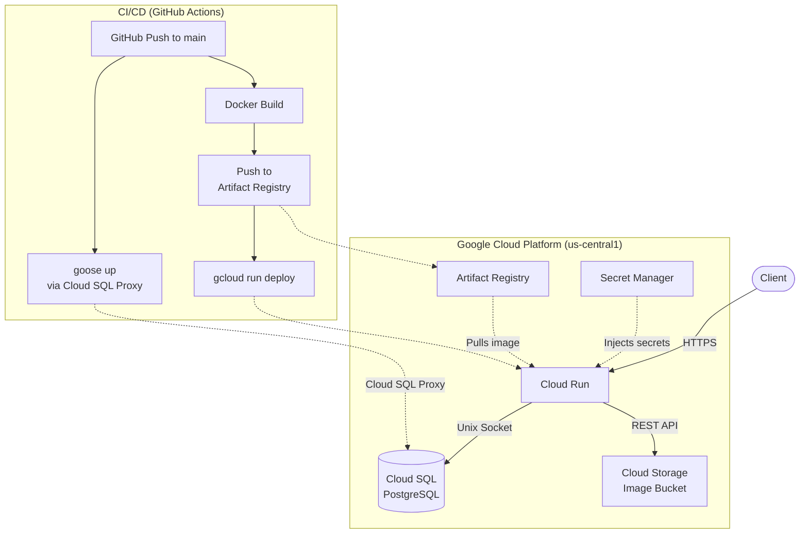

# Image Processing Service

A REST API for image processing built with Go — upload, transform, and store images in the cloud.

Based on the [roadmap.sh image processing service project](https://roadmap.sh/projects/image-processing-service).

## Features

- User registration and JWT authentication
- Email verification (pending)
- Image upload/download via Google Cloud Storage
- Image transformation (resize, format conversion) using [bimg](https://github.com/h2non/bimg) (libvips)
- PostgreSQL for persistent data storage

## Infrastructure (GCP)

The service runs entirely on Google Cloud Platform in the `us-central1` region.



| Service | Purpose |
|---|---|
| **Cloud Run** | Hosts the containerized Go API (auto-scaling, managed) |
| **Cloud SQL** | PostgreSQL instance (`image-db`) — connected via Unix socket |
| **Cloud Storage** | Stores uploaded/processed images (`mbeka02_image_bucket`) |
| **Secret Manager** | Manages `DB_URI`, `SYMMETRIC_KEY`, API keys, etc. |
| **Artifact Registry** | Docker image registry for the service |
| **Workload Identity Federation** | Keyless auth between GitHub Actions and GCP |

## CI/CD Pipeline

On every push to `main`, the [GitHub Actions workflow](.github/workflows/deploy.yaml) runs:

1. **Authenticate** to GCP via Workload Identity Federation (no stored keys)
2. **Run database migrations** — installs [goose](https://github.com/pressly/goose), connects to Cloud SQL through the Cloud SQL Proxy, and applies pending migrations
3. **Build** the Docker image (multi-stage: Go + Alpine + libvips)
4. **Push** to Artifact Registry
5. **Deploy** a new Cloud Run revision with secrets injected from Secret Manager

## Database Migrations

Migrations are managed with [goose](https://github.com/pressly/goose) and live in `sql/schema/`. They run automatically in CI before each deployment.

**Local usage** (requires goose installed and `DB_URI` in `.env`):

```bash
make migrate-up       # Apply all pending migrations
make migrate-down     # Roll back the last migration
make migrate-status   # Show current migration state
make migrate-create   # Create a new migration file
```

**Install goose:**

```bash
go install github.com/pressly/goose/v3/cmd/goose@v3.22.1
```

## Local Development

### Prerequisites

- Go 1.23+
- [libvips](https://www.libvips.org/install.html) (required by bimg)
- PostgreSQL
- [air](https://github.com/air-verse/air) (optional, for live reload)

### Setup

1. Clone the repository
2. Copy `.env.example` to `.env` and configure environment variables
3. Run database migrations: `make migrate-up`
4. Start the server: `make watch` (live reload) or `make run`

## Dependencies

### Go Packages

- [h2non/bimg](https://github.com/h2non/bimg) — image processing (libvips bindings)
- [chi](https://github.com/go-chi/chi) — HTTP router
- [golang-jwt](https://github.com/golang-jwt/jwt) — JWT authentication
- [lib/pq](https://github.com/lib/pq) — PostgreSQL driver
- [sqlc](https://github.com/sqlc-dev/sqlc) — type-safe SQL code generation
- [goose](https://github.com/pressly/goose) — database migrations
- [viper](https://github.com/spf13/viper) — configuration management
- [gomail](https://github.com/go-gomail/gomail) — email sending

### External Services

- [PostgreSQL](https://www.postgresql.org/) — relational database
- [Google Cloud Storage](https://cloud.google.com/storage) — object storage for images
- [Mailtrap](https://mailtrap.io/) — transactional email delivery

---

> **Note:** This project is primarily a learning exercise and is not intended for commercial use.
